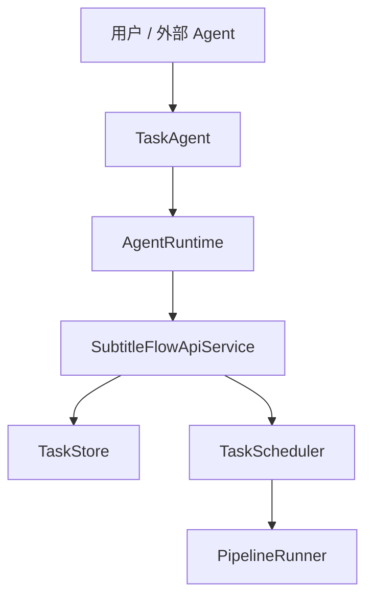
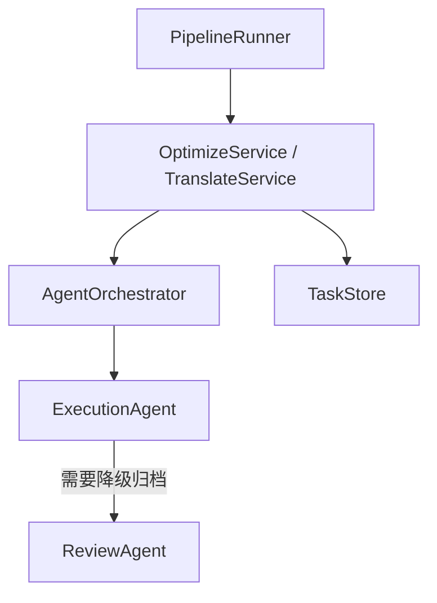
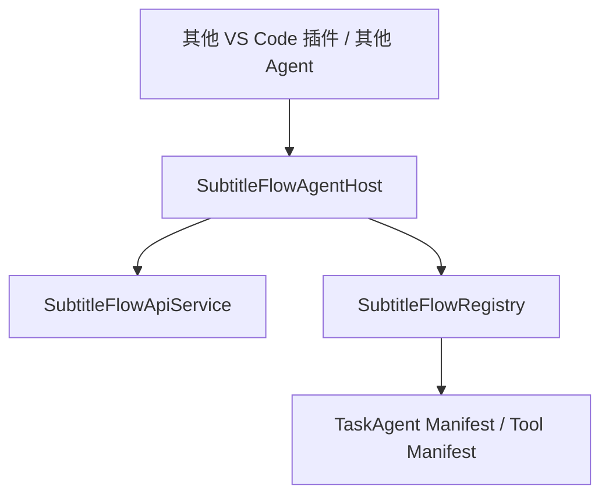

# Agent 架构设计文档

## 文档目标

本文档只讨论 agent 相关设计，不重复解释 Whisper、SRT 或 VS Code 扩展的基础实现细节。

目标是明确以下问题：

1. 当前有哪些 agent
2. 每个 agent 的职责边界是什么
3. agent 之间如何调用
4. 哪些能力允许对外暴露
5. 后续扩展时哪些约束不能破坏

## 设计原则

当前 agent 体系遵守以下原则：

1. `TaskAgent` 负责任务编排，不负责字幕语义处理
2. `ExecutionAgent` 负责 LLM 阶段的恢复决策，不负责用户交互
3. `ReviewAgent` 负责失败归档与候选收集，不负责主链路重试
4. agent 之间不直接互调，由 `AgentOrchestrator` 负责 handoff
5. 对外暴露 capability，不对外暴露内部 agent 实现类
6. 长耗时工作交给后台任务系统，不绑定在单次 chat 响应里

## Agent 一览

### TaskAgent

位置：

- [src/agents/task-agent/index.ts](/Users/wedaren/repositoryDestinationOfGithub/whisperBatcher/src/agents/task-agent/index.ts)
- [src/agents/task-agent/README.md](/Users/wedaren/repositoryDestinationOfGithub/whisperBatcher/src/agents/task-agent/README.md)

职责：

- 解析用户自然语言和 slash command
- 识别单文件任务、目录批量任务、任务查询和任务控制意图
- 基于工具清单生成有限步数的执行计划
- 通过 runtime 调用任务控制工具

典型输入：

- `@subtitleFlow 生成字幕 "/abs/demo.mp4"`
- `@subtitleFlow 为目录 "/abs/folder" 下的所有视频提供字幕`
- `@subtitleFlow 重试失败任务`

典型输出：

- 工具调用计划
- 当前任务状态摘要
- 批量任务摘要

不负责：

- 不直接调用 Whisper CLI
- 不直接调用 LLM 优化或翻译
- 不直接分析失败块
- 不直接操作内部 agent 类

### ExecutionAgent

位置：

- [src/agents/execution-agent/index.ts](/Users/wedaren/repositoryDestinationOfGithub/whisperBatcher/src/agents/execution-agent/index.ts)
- [src/agents/execution-agent/README.md](/Users/wedaren/repositoryDestinationOfGithub/whisperBatcher/src/agents/execution-agent/README.md)

职责：

- 为 `optimize` / `translate` 阶段提供恢复策略
- 对 `call_error`、`refusal`、`parse_mismatch`、`untranslated` 等失败类型做受控决策
- 在有限尝试次数内切换 prompt 变体或降级策略
- 优先保证主任务继续，而不是在单个坏块上长时间停留

典型输入：

- stage
- chunk 文本
- 当前 prompt 变体
- 历史尝试次数
- 失败类型

典型输出：

- 下一次恢复动作
- 是否继续重试
- 是否立即降级
- 给 ReviewAgent 的失败载荷

不负责：

- 不理解用户自然语言
- 不维护任务列表
- 不直接写最终 review 文件
- 不自动修改正式词典

### ReviewAgent

位置：

- [src/agents/review-agent/index.ts](/Users/wedaren/repositoryDestinationOfGithub/whisperBatcher/src/agents/review-agent/index.ts)
- [src/agents/review-agent/README.md](/Users/wedaren/repositoryDestinationOfGithub/whisperBatcher/src/agents/review-agent/README.md)

职责：

- 记录最终失败块
- 生成 `manual-review.json`
- 生成 `lexicon-candidates.json`
- 为后续人工维护或离线分析保留证据

典型输入：

- stage
- chunk 序号
- 原文片段
- 失败类型
- 降级动作

典型输出：

- review artifact 文件
- 候选词条记录

不负责：

- 不参与主链路重试
- 不阻塞任务完成
- 不直接回灌词典
- 不直接回调 ExecutionAgent

### AgentOrchestrator

位置：

- [src/agents/orchestrator/index.ts](/Users/wedaren/repositoryDestinationOfGithub/whisperBatcher/src/agents/orchestrator/index.ts)
- [src/agents/orchestrator/README.md](/Users/wedaren/repositoryDestinationOfGithub/whisperBatcher/src/agents/orchestrator/README.md)

职责：

- 负责 agent handoff
- 接收来自 `OptimizeService` / `TranslateService` 的恢复请求
- 先调用 `ExecutionAgent`
- 在需要时把失败载荷交给 `ReviewAgent`

核心约束：

- orchestrator 是内部 agent 切换的唯一入口
- 任何 agent 都不应直接 import 另一个 agent 并调用其业务方法

### AgentRuntime

位置：

- [src/agents/runtime/index.ts](/Users/wedaren/repositoryDestinationOfGithub/whisperBatcher/src/agents/runtime/index.ts)
- [src/agents/runtime/README.md](/Users/wedaren/repositoryDestinationOfGithub/whisperBatcher/src/agents/runtime/README.md)

职责：

- 为 `TaskAgent` 提供统一工具执行上下文
- 封装 VS Code Chat tool 调用结果
- 为后续更复杂的上层交互 agent 预留统一运行时契约

## 调用关系

### 任务控制面

说明：

- `TaskAgent` 只负责任务控制面
- `TaskAgent` 不直接运行 Whisper 和 LLM
- 实际执行仍由 `TaskScheduler` 和 `PipelineRunner` 承担

### LLM 阶段恢复链

说明：

- `OptimizeService` / `TranslateService` 不自己拼装多 agent 链路
- 恢复决策由 `ExecutionAgent` 负责
- 失败归档由 `ReviewAgent` 负责
- 手续统一经 `AgentOrchestrator` 进入

### 对外能力暴露

说明：

- 外部集成应通过 `agentHost` 或稳定 `exports API`
- 外部不应直接依赖 `TaskAgent`、`ExecutionAgent`、`ReviewAgent` 类
- `SubtitleFlowRegistry` 负责提供能力清单与 manifest 元数据

## 典型时序

### 单文件字幕任务

1. 用户输入 `@subtitleFlow 生成字幕 "/abs/demo.mp4"`
2. `TaskAgent` 解析出单文件任务意图
3. `TaskAgent` 生成计划：`enqueue -> runPending -> get`
4. `AgentRuntime` 按顺序执行工具
5. `SubtitleFlowApiService` 创建任务并启动调度
6. `TaskScheduler` 在后台执行 `PipelineRunner`
7. `TaskAgent` 返回当前任务 ID 与初始状态

### 目录批量任务

1. 用户输入目录批量请求
2. `TaskAgent` 解析目录意图
3. 目录类自然语言默认走递归扫描
4. `TaskAgent` 生成计划：`scanDirectory -> enqueueTasks -> runPending -> list`
5. 返回批量创建结果和当前队列状态

### LLM 坏块恢复

1. `OptimizeService` 或 `TranslateService` 遇到坏块
2. 服务把失败上下文提交给 `AgentOrchestrator`
3. `ExecutionAgent` 判断：
   - 同策略重试
   - 切换保守 prompt
   - 切换严格格式 prompt
   - 直接降级
4. 如果最终降级，`AgentOrchestrator` 再调用 `ReviewAgent`
5. `ReviewAgent` 写出 review artifact
6. 主任务继续运行

## 对外集成边界

### 允许对外暴露

- `SubtitleFlowApi`
- `SubtitleFlowAgentHost`
- capability 列表
- tool manifest 摘要
- participant manifest 摘要

### 不允许对外暴露为稳定契约

- `TaskAgent` 内部 parser / planner 细节
- `ExecutionAgent` 恢复策略内部实现
- `ReviewAgent` 文件写入细节
- `AgentOrchestrator` 内部 handoff 结构

原因：

- 这些都属于内部演化空间
- 一旦被外部直接依赖，会锁死后续重构

## 扩展约束

后续新增 agent 或新能力时，必须满足以下约束：

1. 新 agent 必须有单独目录、README、manifest
2. 新 agent 不得直接互调其他 agent
3. 新 handoff 必须通过 `AgentOrchestrator`
4. 新对外能力必须先进入 `SubtitleFlowRegistry`
5. VS Code Copilot 相关受管字段必须由构建期脚本同步到 `package.json`
6. 长耗时任务不得重新绑定到单次 chat 同步等待模型

## 当前已知限制

1. `TaskAgent` 目前是受控 planner，不是开放式自由代理
2. `ExecutionAgent` 目前主要是规则驱动恢复，而不是模型驱动恢复
3. `ReviewAgent` 目前只生成工件，不提供审批工作流
4. CLI / MCP 还未完全接入同一套 registry

## 建议的后续演进方向

1. 让 CLI / MCP 共用 `SubtitleFlowRegistry`
2. 为 `agentHost` 增加 capability 版本与兼容信息
3. 为 `ReviewAgent` 增加人工审批工作流，但仍保持“不自动写正式词典”
4. 为 `TaskAgent` 增加更强的批量任务总结和批量恢复计划
